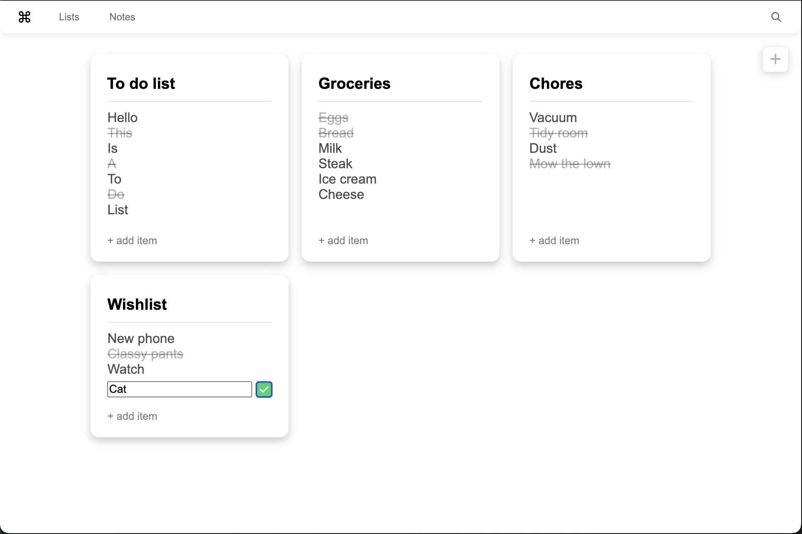

# To-Do List

## A minimalist To-Do List application project

### _The features:_

- Sleek interface
- Easy and intuitive to use

### _More to come:_

- Night mode
- Time stamps
- Notes!

Project made for learning purposes.

As a challenge, changes are saved to a json file through a custom API using only regular Web APIs.

Developped with Vite/React.ts and Deno.
Icons from [Font Awesome](https://fontawesome.com/)
